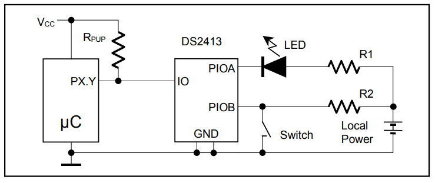
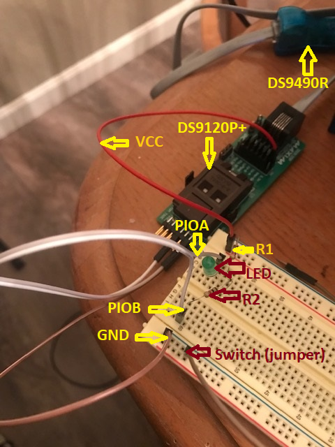
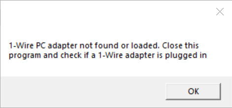
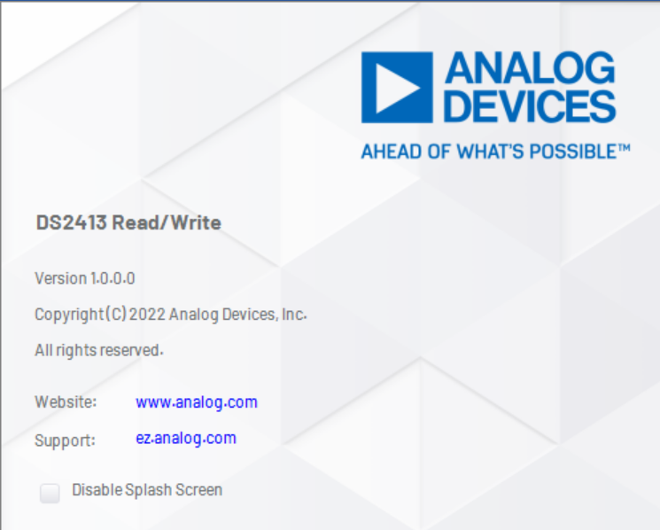
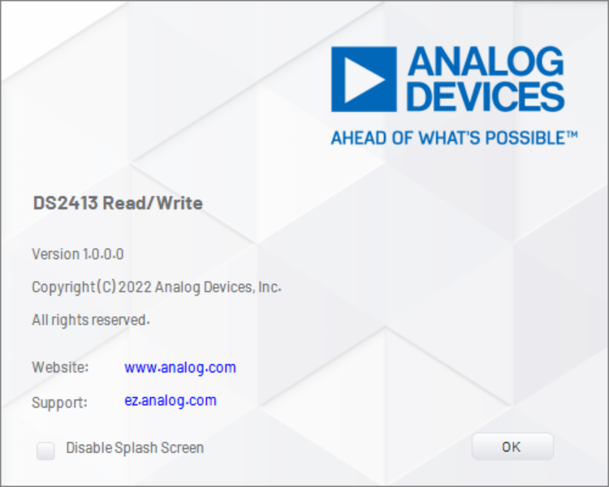
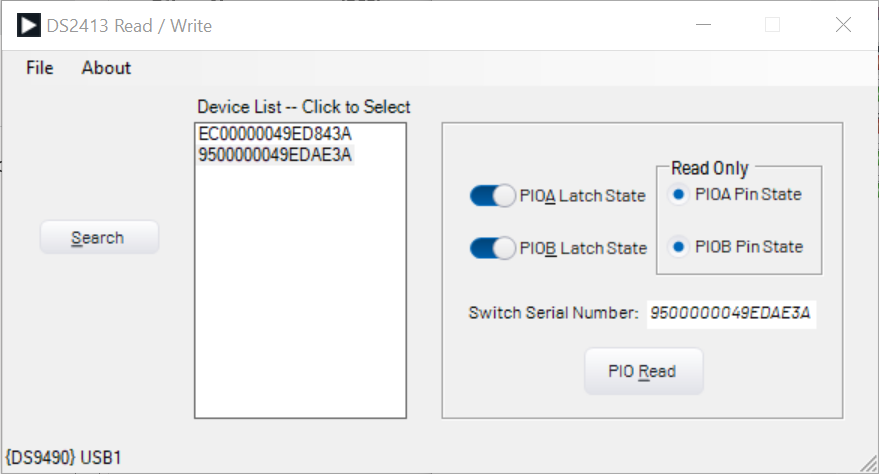

## Description

This is a C# graphical user interface (GUI) for Windows 10 x64, specifically to read and write the [DS2413](https://www.maximintegrated.com/en/products/interface/controllers-expanders/DS2413.html) 1-Wire Dual-Channel Addressable Switch devices. The GUI allows for exercising both GPIO channels and reading their latch states and pin states. 

## Hardware Requirements
-	2 DS2413 devices in TSOC packages (DS2413P+).
-	[DS9120P+](https://www.maximintegrated.com/en/products/interface/controllers-expanders/DS9120.html) 1-Wire socket board (comes with RJ12 male/male cable). It can hold 2 DS2413 devices. 
-	A 1-Wire PC adapter.  User either the [DS9490R# USB-to-1-Wire PC adapter](https://www.maximintegrated.com/en/products/ibutton-one-wire/ibutton/DS9490R.html) or the [DS9481R-3C7 USB-to-Serial 1-Wire adapter](https://www.maximintegrated.com/en/products/ibutton-one-wire/ibutton/DS9481R-3C7.html).
-	Test circuit materials. This is up to the user to create, but the circuit used to test the program includes a breadboard, 1 LED, two 1KOhm resistors, 6 Dupont wires (4 female-male, and 2 male-male). 
-	Connect the 1-Wire adapter of choice to the PC on a spare USB port. Plug the RJ12 cable into the adapter with the other end plugged into DS9120P+.  Insert 2 DS2413 devices into the clamshell socket.  Use the test circuit materials to create the circuit in Figure 1 below. A picture of the test circuit on a breadboard is shown in Figure 2.

     
    
    *Figure 1.  DS2413 Test Circuit Taken from Page 1 of Data Sheet.*

     
    
    *Figure 2.  DS2413 Test Circuit on Breadboard.*    
 
## Software Development Tools and Dependencies
-	Visual Studio 2017 capable of writing C# programs.
-	[.NET version 4.8 runtime](https://dotnet.microsoft.com/en-us/download/dotnet-framework/net48) pre-installed. If compiling, please install the developer pack.
-	It assumes that the [1-Wire Drivers](https://www.maximintegrated.com/en/products/ibutton-one-wire/one-wire/software-tools/drivers/download-1-wire-ibutton-drivers-for-windows.html) have been installed for the USB DS9490R adapter support but should work stand-alone without 1-Wire Drivers for the DS9481R-3C7 PC adapter. 
-  Before installing the 1-Wire Drivers, make sure the adapter is unplugged.  For extra 1-Wire Drivers help see this [troubleshooting guide](https://maximsupport.microsoftcrmportals.com/en-us/knowledgebase/article/KA-16429).

## Downloading and Running
- From this GitHub page, click the [1-Wire_SDK_Examples](https://github.com/MaximIntegratedTechSupport/1-Wire_SDK_Examples) link and then click the Code button followed by the "Download Zip" option.  Unzip the downloaded file and find the executable and double-click.
  
## Operation or Software Flow
When run, the GUI software will do the following before the main Window appears:
1.	Automatically discover the first 1-Wire adapter it can.  It first looks tries to find if a DS9490R 1-Wire USB adapter exists on “USB1”.  The 1-Wire Drivers assign USB1 to the device that was most recently plugged in. If it doesn’t find one there, it will attempt to find a DS9481R-3C7 serial port 1-Wire adapter on COM1 through COM64. If no adapters are found, the GUI will generate a “MessageBox” error message before the main Window appears and before the Splash Screen is visible (see step 2). Figure 3 shows the error message.

     
 
    *Figure 3.  No Adapter Found Error.*

2.	The GUI will display a splash screen before the main window appears (using the LookAndFeel.dll).  It will appear for 3 seconds and give the name of the software, along with copyright information, version information, and how to contact Analog Devices. It also has a checkbox that a user can check to disable the splash screen as desired. Figure 4 shows the splash screen. To re-enable the splash screen, the user can click the “About” menu item from the main menu of the main GUI window as shown in Figure 5 below. This is the same splash screen but dismisses with a click of the “OK” button.

      	 
 
    Figure 4.  Splash Screen on Startup. 		

      	 
 
    *Figure 5. About Screen with OK Button.*

When the main Window appears, it will contain a Search button that searches for 1-Wire switches when clicked, a ListView to display the serial numbers of the DS2413 devices found from a search, and an area to exercise the DS2413 selected from the ListView (a.k.a., the “Device List”). This area has 2 GUI toggle switches allowing the user to toggle the latch states of PIOA and PIOB, along with a read-only area to display the pin states with radio boxes. It also contains a GUI label that displays the selected DS2413’s serial number, along with a "PIO Read" button that reads the status of both latches when clicked. See Figure 6 below for a screenshot. See Figure 6 below.

      

   *Figure 6. GUI Main Window*

### PIOA and B Latch State Toggle Switches
When the PIOA or PIOB Latch State GUI Toggle switch is clicked, the program shall perform a PIO Access Write command setting the hardware’s specific latch states to the value indicated by the GUI. For immediate effect, this shall be followed by a PIO Access Read command sequence to display the results of both PIO pin states (and latch states).

### Reading
The button labeled “PIO Read” on the GUI (see Figure 5) simply performs a PIO Access Read command sequence and reads the states of both switches, including latch states and pin states, and updates the GUI to show what these are (i.e., the GUI toggle switches, and the GUI radio boxes).  

### Other GUI Functions 
1.	The Status Bar. This is at the very bottom of the main Window and shall either display “No Adapter Found” or the adapter and port, such as “{DS9490} USB1” connected as shown in Figure 6.
2.	Main Menu.  See Figure 6. This is located at the top of the main window and consists of “File” and “About” menu items.  When clicking File, it will present a sub menu item called “Exit”.  This causes the program to exit.  Clicking "About" causes the “About Screen” to appear as shown in Figure 5.

